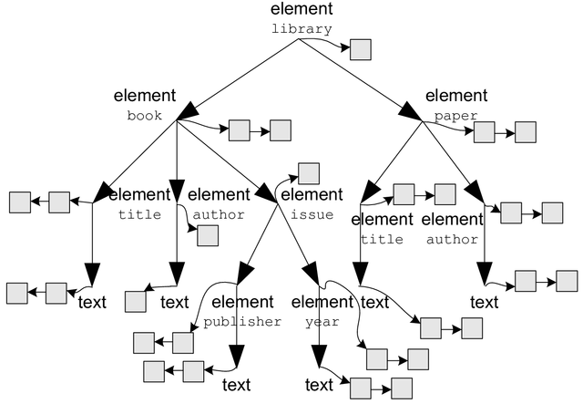

<a href="https://www.digitalproteomics.com">Digital Proteomics</a> reimagines antibody discovery and sequencing with advanced informatics. We contribute these libraries and projects to proteomics and immunoinformatics.

  <h2 class="post-title"><a href="https://github.com/digitalproteomics/dp-mzml">dp-mzml</a></h2>
  
  
A Java-based streaming parser for mzML files.

<!-- /.tile -->

  <h2 class="post-title"><a href="https://github.com/digitalproteomics/pydp">pydp</a></h2>
  
  
Python utilities for deployed applications.

<!-- /.tile -->

  <h2 class="post-title"><a href="https://github.com/digitalproteomics/gecco">GECCO</a></h2>
  
  
Gene conversion classification of immunoglobulins.

<!-- /.tile -->

<!-- /.tiles -->